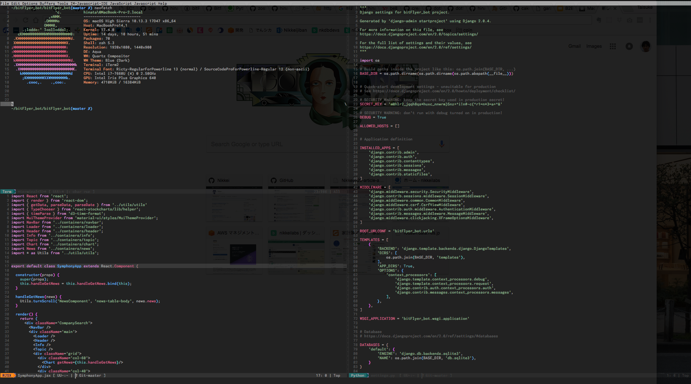

# My Emacs Setup


## Screenshots



## Installation

### For Mac Users

Install using Hombrew.

```
$ brew install emacs
```

If you install emacs from Homebrew, not downloading from Official page, you can use emacs only in CUI.

After installation, restart the terminal and it is completed when it is displayed as follows.

```
$ emacs --version
GNU Emacs 25.2.1
Copyright (C) 2017 Free Software Foundation, Inc.
GNU Emacs comes with ABSOLUTELY NO WARRANTY.
You may redistribute copies of GNU Emacs
under the terms of the GNU General Public License.
For more information about these matters, see the file named COPYING.
```

The installation destination will be in

```
/usr/local/Cellar/emacs/25.3/share/emacs/
```
.

Next install the emacs package. We use Cask for package management.

Update package below.

```
M-x package-refresh-contents
```

```
$ brew install cask
$ cd ~/.emacs.d
$ cask
```

The package written in Cask is installed by the `cask` .

### For Ubuntu users

```
$ git clone https://github.com/hinatades/.emacs.d
$ curl -fsSL https://raw.githubusercontent.com/cask/cask/master/go | python
```
でcaskコマンドをインストールし

```.bashrc
PATH="$HOME/.cask/bin:$PATH"
```

でパスを通します。その後

```
$ source ~/.bashrc
```

でシェルの設定を更新することでcaskコマンドが使えます。
init.elのcaskの読み込み分を

```
;; (require 'cask)
(require 'cask "~/.cask/cask.el")
```

と書き換え、

```
$ .emacs.d
$ cask
```

で完了。

## Tips

| 機能                   | Keybind     |
|------------------------|-------------|
| ウィンドウ切り替え     | `C-t`       |
| 一括インデント         | `C-x C-]`   |
| ファイル検索           | `C-x C-f`   |
| プロジェクト文字列検索 | `C-x C-g`   |
| コメントアウト         | `M-;`       |
| Markdown プレビュー    | `C-c C-c p` |
| multi-term             | `C-x C-m`   |


## その他

## elispファイルの追加

1. elisp/以下にhogehoge.elファイルを配置
2. init.el に(require 'hogehoge)を追記しロードする

### カラーテーマ

- https://github.com/emacs-jp/replace-colorthemes

## emacs のパッケージシステム

emacsのパッケージシステムは

- package.el
- auto-install.el
- El-Get

などがある。auto-install.elは割りと古いパッケージシステムなので導入方法をメモしておく。なお、本リポジトリは上記のパッケージをすでに導入済みなので以下を行う必要はない。

```
$ cd ~/.emacs.d/elisp
$ wget http://www.emacswiki.org/emacs/download/auto-install.el
```

あとはinit.elに

```
;;; auto-installの設定
(add-to-list 'load-path "~/.emacs.d/elisp/")
(require 'auto-install)
;;インストールディレクトリを設定する 初期値は ~/.emacs.d/auto-install/
(setq auto-install-directory "~/.emacs.d/elisp/")
```

auto-installを導入することで

```
M-x install-elisp URL
M-x install-elisp-from-emacswiki EmacsWikiのページ名
M-x install-elisp-from-gist gist-id
M-x auto-install-batch パッケージ名 
```

が使えるようになる。


## 参考資料

- [突然だがEmacs を始めよう](https://qiita.com/bussorenre/items/bbe757ef87e16c3d31ff)
- [Emacsでもしゃれた画面でプログラミングがしたい！！](https://qiita.com/itome0403/items/05dc50f6bfbdfb04c0cf)
- [Mac 標準terminal、iterm2のEmacsでpowerlineが文字化けするのを修正する](https://joppot.info/2017/04/17/3824)
- [EmacsでTwitter: twittering-modeの設定メモった。](http://fukuyama.co/twittering-mode)
- [Emacs で Rails の開発効率を上げる Projectile Rails まとめ](https://qiita.com/elbowroomer/items/8e3c4b075a181f224591)
- [Emacsでmarkdown-modeを使用する](http://moonstruckdrops.github.io/blog/2013/03/24/markdown-mode/)
- [Macでプログラミング用のフォントRictyを設置した話](https://qiita.com/park-jh/items/3c5b9b4aa5619a3631b3)
- [emacsで、全行インデントを一括で行う方法](https://qiita.com/AnchorBlues/items/2e216f730c1e9b84a593)
